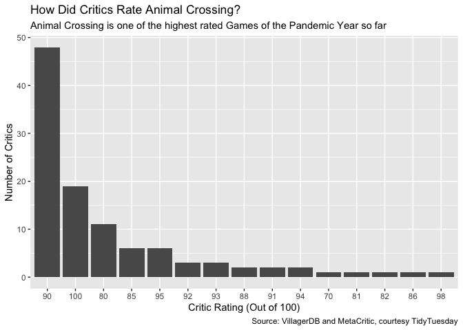
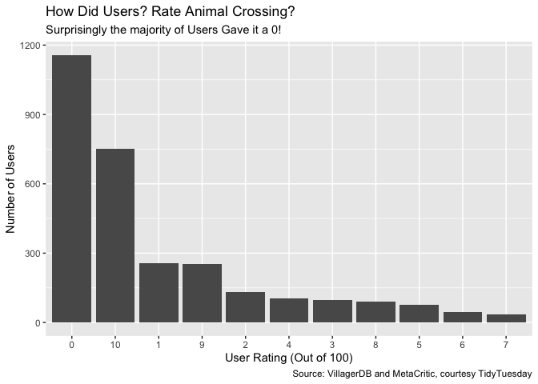

TidyTuesday - Animal Crossing
================
Usman Khaliq
2020-05-06

  - [Start\!](#start)
  - [Explore the data](#explore-the-data)
  - [Is Animal Crossing the New Darling of the Quarantined
    Critics?](#is-animal-crossing-the-new-darling-of-the-quarantined-critics)
  - [Do Fans Also Love Animal Crossing With the Same
    Dedication?](#do-fans-also-love-animal-crossing-with-the-same-dedication)

``` r
# Libraries
library(tidyverse)
library(readr)

# Parameters

#url for critic data
url_critic <- "https://raw.githubusercontent.com/rfordatascience/tidytuesday/master/data/2020/2020-05-05/critic.tsv"

#url for user reviews
url_user_reviews <- "https://raw.githubusercontent.com/rfordatascience/tidytuesday/master/data/2020/2020-05-05/user_reviews.tsv"

#url for items 
url_items <- "https://raw.githubusercontent.com/rfordatascience/tidytuesday/master/data/2020/2020-05-05/items.csv"

#url for villagers
url_villagers <- "https://raw.githubusercontent.com/rfordatascience/tidytuesday/master/data/2020/2020-05-05/villagers.csv"

#===============================================================================

# Code 

#load the data

critic <- 
  url_critic %>% 
  read_tsv()

user_reviews <-
  url_user_reviews %>% 
  read_tsv()

items <-
  url_items %>% 
  read_tsv()

villagers <-
  url_villagers %>% 
  read_tsv()
```

## Start\!

I haven’t bought Animal Crossing on my Switch yet; I have discovered a
newfound addiction for the Legend of Zelda: Breadth of the Wild, and
have vowed to finally complete it this year. However, I am happy to dig
into this TidyTuesday dataset, and explore this dataset from two angles
right now:

  - Trends in User Reviews and Critic Reviews
  - Sentiment analysis on user’s opinions about the game, and exploring
    whether there are any general differences in how users and critics
    are reviewing the game.

## Explore the data

First, lets explore the animal crossing dataset

``` r
glimpse(critic)
```

    ## Rows: 107
    ## Columns: 4
    ## $ grade       <dbl> 100, 100, 100, 100, 100, 100, 100, 100, 100, 100, 100, 95…
    ## $ publication <chr> "Pocket Gamer UK", "Forbes", "Telegraph", "VG247", "Ninte…
    ## $ text        <chr> "Animal Crossing; New Horizons, much like its predecessor…
    ## $ date        <date> 2020-03-16, 2020-03-16, 2020-03-16, 2020-03-16, 2020-03-…

``` r
summary(critic)
```

    ##      grade        publication            text                date           
    ##  Min.   : 70.00   Length:107         Length:107         Min.   :2020-03-16  
    ##  1st Qu.: 90.00   Class :character   Class :character   1st Qu.:2020-03-16  
    ##  Median : 90.00   Mode  :character   Mode  :character   Median :2020-03-23  
    ##  Mean   : 90.64                                         Mean   :2020-03-25  
    ##  3rd Qu.: 94.00                                         3rd Qu.:2020-04-02  
    ##  Max.   :100.00                                         Max.   :2020-05-01

``` r
glimpse(user_reviews)
```

    ## Rows: 2,999
    ## Columns: 4
    ## $ grade     <dbl> 4, 5, 0, 0, 0, 0, 0, 0, 0, 0, 1, 0, 0, 0, 0, 0, 0, 0, 0, 0,…
    ## $ user_name <chr> "mds27272", "lolo2178", "Roachant", "Houndf", "ProfessorFox…
    ## $ text      <chr> "My gf started playing before me. No option to create my ow…
    ## $ date      <date> 2020-03-20, 2020-03-20, 2020-03-20, 2020-03-20, 2020-03-20…

``` r
summary(user_reviews)
```

    ##      grade         user_name             text                date           
    ##  Min.   : 0.000   Length:2999        Length:2999        Min.   :2020-03-20  
    ##  1st Qu.: 0.000   Class :character   Class :character   1st Qu.:2020-03-24  
    ##  Median : 2.000   Mode  :character   Mode  :character   Median :2020-03-27  
    ##  Mean   : 4.217                                         Mean   :2020-04-01  
    ##  3rd Qu.:10.000                                         3rd Qu.:2020-04-06  
    ##  Max.   :10.000                                         Max.   :2020-05-03

## Is Animal Crossing the New Darling of the Quarantined Critics?

Lets see if critics unanimously love Animal Crossing

``` r
critic %>%
  count(grade) %>% 
  arrange(desc(n)) %>% 
  mutate(grade = fct_reorder(factor(grade), n, .desc = TRUE)) %>% 
  ggplot(aes(grade, n)) +
  geom_col() +
  labs(
    title = "How Did Critics Rate Animal Crossing?",
    subtitle = "Animal Crossing is one of the highest rated Games of the Pandemic Year so far",
    x = "Critic Rating (Out of 100)",
    y = "Number of Critics",
    caption = "Source: VillagerDB and MetaCritic, courtesy TidyTuesday"
  )
```

<!-- -->

## Do Fans Also Love Animal Crossing With the Same Dedication?

Lets see if fans also are as gagga over the game as the critics are.

``` r
user_reviews %>%
  count(grade) %>% 
  arrange(desc(n)) %>% 
  mutate(grade = fct_reorder(factor(grade), n, .desc = TRUE)) %>% 
  ggplot(aes(grade, n)) +
  geom_col() +
  labs(
    title = "How Did Users Rate Animal Crossing?",
    subtitle = "Surprisingly the majority of Users Gave it a 0!",
    x = "User Rating (Out of 100)",
    y = "Number of Users",
    caption = "Source: VillagerDB and MetaCritic, courtesy TidyTuesday"
  )
```

<!-- -->
