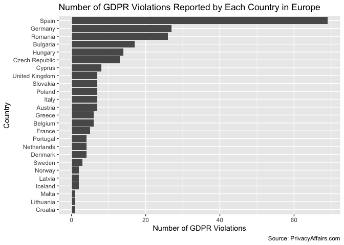

Tidy Tuesday - GDPR Violations
================
Usman Khaliq
2020-04-24

  - [1d Exploratory Data Analysis of the
    Datasets](#d-exploratory-data-analysis-of-the-datasets)
      - [Subsection](#subsection)
  - [Section 2](#section-2)

``` r
# Libraries
library(tidyverse)
library(readr)
# Parameters

#URLs for downloading the data
gdpr_tsv_url <- "https://raw.githubusercontent.com/rfordatascience/tidytuesday/master/data/2020/2020-04-21/gdpr_violations.tsv"

gdpr_txt_url <- "https://raw.githubusercontent.com/rfordatascience/tidytuesday/master/data/2020/2020-04-21/gdpr_text.tsv" 

#Load the data
gdpr_violations <- 
  gdpr_tsv_url %>%
  read_tsv()
  
gdpr_text <- 
  gdpr_txt_url %>% 
  read_tsv()
#===============================================================================
```

## 1d Exploratory Data Analysis of the Datasets

First, let us examine the `gdpr_violations` and `gdpr_text` tibbles.

``` r
gdpr_violations %>% 
  glimpse()
```

    ## Rows: 250
    ## Columns: 11
    ## $ id               <dbl> 1, 2, 3, 4, 5, 6, 7, 8, 9, 10, 11, 12, 13, 14, 15, 1…
    ## $ picture          <chr> "https://www.privacyaffairs.com/wp-content/uploads/2…
    ## $ name             <chr> "Poland", "Romania", "Spain", "Spain", "Romania", "R…
    ## $ price            <dbl> 9380, 2500, 60000, 8000, 150000, 20000, 200000, 2000…
    ## $ authority        <chr> "Polish National Personal Data Protection Office (UO…
    ## $ date             <chr> "10/18/2019", "10/17/2019", "10/16/2019", "10/16/201…
    ## $ controller       <chr> "Polish Mayor", "UTTIS INDUSTRIES", "Xfera Moviles S…
    ## $ article_violated <chr> "Art. 28 GDPR", "Art. 12 GDPR|Art. 13 GDPR|Art. 5 (1…
    ## $ type             <chr> "Non-compliance with lawful basis for data processin…
    ## $ source           <chr> "https://uodo.gov.pl/decyzje/ZSPU.421.3.2019", "http…
    ## $ summary          <chr> "No data processing agreement has been concluded wit…

``` r
gdpr_text %>% 
  glimpse()
```

    ## Rows: 425
    ## Columns: 7
    ## $ chapter       <dbl> 1, 1, 1, 1, 1, 1, 1, 1, 1, 1, 1, 1, 1, 1, 1, 1, 1, 2, 2…
    ## $ chapter_title <chr> "General provisions", "General provisions", "General pr…
    ## $ article       <dbl> 1, 1, 1, 2, 2, 2, 2, 3, 3, 3, 3, 4, 4, 4, 4, 4, 4, 5, 5…
    ## $ article_title <chr> "Subject-matter and objectives", "Subject-matter and ob…
    ## $ sub_article   <dbl> 1, 2, 3, 1, 2, 3, 4, 1, 2, 3, 4, 1, 2, 3, 4, 5, 6, 1, 2…
    ## $ gdpr_text     <chr> "This Regulation lays down rules relating to the protec…
    ## $ href          <chr> "http://gdpr-info.eu/art-1-gdpr/", "http://gdpr-info.eu…

Lets create a column bar to see which countries had the highest number
of GDPR violations

``` r
gdpr_violations %>% 
  count(name) %>% 
  arrange(desc(n)) %>% 
  mutate(name = fct_reorder(name, n)) %>% 
  ggplot(aes(name, n)) +
  geom_col() +
  coord_flip() +
  labs(
    title = "Number of GDPR Violations Reported by Each Country in Europe",
    x = "Country",
    y = "Number of GDPR Violations",
    caption = "Source: PrivacyAffairs.com"
  )
```

<!-- -->

### Subsection

## Section 2
