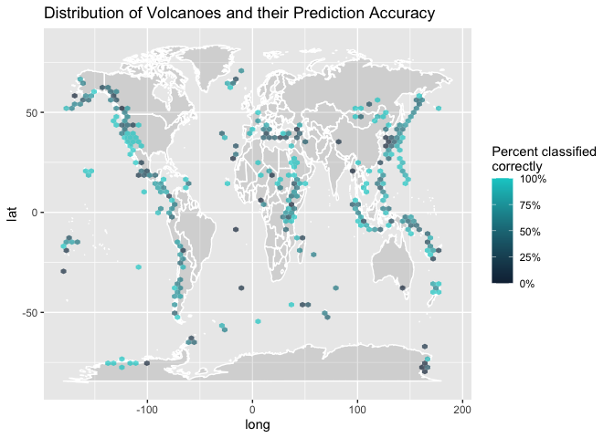

Volcano Eruptions
================
Usman Khaliq
2020-05-20

  - [Reference](#reference)
      - [Explore the data](#explore-the-data)
  - [Exploratory Data Analysis](#exploratory-data-analysis)
  - [Build a Model](#build-a-model)
      - [Preprocessing](#preprocessing)
      - [Setting up the Model.](#setting-up-the-model.)
      - [Explore the Results](#explore-the-results)

``` r
# Libraries
library(tidyverse)
library(readr)
library(tidymodels)
library(themis)
library(workflows)
library(tune)
library(vip)
library(janitor)

# Parameters
# Parameters

#volcano link
volcano_url <- "https://raw.githubusercontent.com/rfordatascience/tidytuesday/master/data/2020/2020-05-12/volcano.csv"

#eruptions link
eruptions_url <- "https://raw.githubusercontent.com/rfordatascience/tidytuesday/master/data/2020/2020-05-12/eruptions.csv"

#events link
events_url <- "https://raw.githubusercontent.com/rfordatascience/tidytuesday/master/data/2020/2020-05-12/events.csv"

#tree rings link
tree_rings_url <- "https://raw.githubusercontent.com/rfordatascience/tidytuesday/master/data/2020/2020-05-12/tree_rings.csv"

#sulfur link
sulfur_url <- "https://raw.githubusercontent.com/rfordatascience/tidytuesday/master/data/2020/2020-05-12/sulfur.csv" 

volcano <-
  volcano_url %>% 
  read_csv()

eruptions <- 
  eruptions_url %>% 
  read_csv()

events <- 
  events_url %>% 
  read_csv()

tree_rings <- 
  tree_rings_url %>% 
  read_csv()

sulfur <-
  sulfur_url %>% 
  read_csv()

#===============================================================================

# Code
```

Lets build a multiclass random forest classifier to predict the type of
volcano based on other volcanic characteristics like latitude, tectonic
settings etc.

## Reference

I referred to Julia Silge’s excellent
[tutorial](https://www.youtube.com/watch?v=0WCmLYvfHMw&list=LL-xYEpkLu4daSJnUSohR-pw&index=2&t=0s)
on building multiclass classifiers with tidymodels.

### Explore the data

``` r
volcano %>% 
  count(primary_volcano_type, sort = TRUE)
```

    ## # A tibble: 26 x 2
    ##    primary_volcano_type     n
    ##    <chr>                <int>
    ##  1 Stratovolcano          353
    ##  2 Stratovolcano(es)      107
    ##  3 Shield                  85
    ##  4 Volcanic field          71
    ##  5 Pyroclastic cone(s)     70
    ##  6 Caldera                 65
    ##  7 Complex                 46
    ##  8 Shield(s)               33
    ##  9 Submarine               27
    ## 10 Lava dome(s)            26
    ## # … with 16 more rows

Since there are 26 different categories of volcanoes in the dataset and
less than a 1000 rows in the `volcano` dataset, lets try to predict a
lower number of volcano types.

``` r
volcano_df <-
  volcano %>% 
  transmute(
    volcano_type = 
      case_when(
        str_detect(primary_volcano_type, "Stratovolcano") ~ "Stratovolcano",
        str_detect(primary_volcano_type, "Shield")        ~ "Shield",
        TRUE                                              ~ "Other"
      ),
    volcano_number,
    latitude,
    longitude,
    elevation,
    tectonic_settings,
    major_rock_1
  ) %>% 
  mutate_if(is_character, factor)
```

## Exploratory Data Analysis

``` r
world <- map_data("world") 

ggplot() +
  geom_map(
    data = world, 
    map = world,
    aes(
      long,
      lat,
      map_id = region
    ),
    colour = "white",
    fill = "gray50",
    alpha = 0.2
  ) +
  geom_point(
    data = volcano_df,
    aes(longitude, latitude, color = volcano_type),
    alpha = 0.8
  )
```

    ## Warning: Ignoring unknown aesthetics: x, y

<!-- -->

The above visualization gives an interesting distribution about the
different types of volcanoes around the world.

## Build a Model

``` r
volcano_boot <- 
  volcano_df %>% 
  bootstraps()
```

Lets observe how many volcano categories there are in our data frame.

``` r
volcano_df %>% 
  count(volcano_type, sort = TRUE)
```

    ## # A tibble: 3 x 2
    ##   volcano_type      n
    ##   <fct>         <int>
    ## 1 Stratovolcano   461
    ## 2 Other           379
    ## 3 Shield          118

As we can see from the above, the number of Shield volcano types are
lower than the other two categories. Lets do some data cleaning to fix
this by using the `themis` package that explicitly deals with class
imbalance. We will be using the `step_smote` function, that uses the
SMOTE algorithm to generate new examples of the minority class using
nearest neighbours of the cases. To do this, we would need to create
dummy variables for our factor variables, and also centre the numeric
variables in `volcano_df`.

### Preprocessing

``` r
volcano_df %>% 
  count(tectonic_settings, sort = TRUE)
```

    ## # A tibble: 11 x 2
    ##    tectonic_settings                                   n
    ##    <fct>                                           <int>
    ##  1 Subduction zone / Continental crust (>25 km)      511
    ##  2 Intraplate / Continental crust (>25 km)           106
    ##  3 Subduction zone / Oceanic crust (< 15 km)          77
    ##  4 Rift zone / Continental crust (>25 km)             74
    ##  5 Rift zone / Oceanic crust (< 15 km)                69
    ##  6 Subduction zone / Intermediate crust (15-25 km)    41
    ##  7 Subduction zone / Crustal thickness unknown        40
    ##  8 Rift zone / Intermediate crust (15-25 km)          21
    ##  9 Intraplate / Oceanic crust (< 15 km)               14
    ## 10 Intraplate / Intermediate crust (15-25 km)          4
    ## 11 Unknown                                             1

We can also see from above that there are around 11 `tectonic_settings`,
so lets collapse a few of the smaller categories of tectonic\_settings.

``` r
volcano_df %>% 
  count(major_rock_1, sort = TRUE)
```

    ## # A tibble: 10 x 2
    ##    major_rock_1                                 n
    ##    <fct>                                    <int>
    ##  1 Andesite / Basaltic Andesite               395
    ##  2 Basalt / Picro-Basalt                      329
    ##  3 Dacite                                      61
    ##  4 Trachybasalt / Tephrite Basanite            57
    ##  5 Rhyolite                                    47
    ##  6 Trachyte / Trachydacite                     29
    ##  7 Trachyandesite / Basaltic Trachyandesite    22
    ##  8 Foidite                                     10
    ##  9 Phonolite                                    6
    ## 10 Phono-tephrite /  Tephri-phonolite           2

We can also collapse a few of the categories of the rocks.

``` r
volcano_rec <-
  recipe(volcano_type ~ ., data = volcano_df) %>% 
  update_role(volcano_number, new_role = "Id") %>% 
  step_other(tectonic_settings) %>% 
  step_other(major_rock_1) %>% 
  step_dummy(tectonic_settings, major_rock_1) %>% 
  step_zv(all_predictors()) %>% 
  step_normalize(all_predictors()) %>% 
  step_smote(volcano_type)

volcano_prep <-
  volcano_rec %>% 
  prep()
```

To look at the results from a recipe, we can `juice` from it.

``` r
juice(volcano_prep)
```

    ## # A tibble: 1,383 x 14
    ##    volcano_number latitude longitude elevation volcano_type tectonic_settin…
    ##             <dbl>    <dbl>     <dbl>     <dbl> <fct>                   <dbl>
    ##  1         213004   0.746      0.101   -0.131  Other                  -0.289
    ##  2         284141   0.172      1.11    -1.39   Other                  -0.289
    ##  3         282080   0.526      0.975   -0.535  Other                  -0.289
    ##  4         285070   0.899      1.10    -0.263  Other                  -0.289
    ##  5         320020   1.44      -1.45     0.250  Other                  -0.289
    ##  6         221060  -0.0377     0.155   -0.920  Other                  -0.289
    ##  7         273088   0.0739     0.888    0.330  Other                  -0.289
    ##  8         266020  -0.451      0.918   -0.0514 Other                  -0.289
    ##  9         233011  -0.873      0.233   -0.280  Other                  -0.289
    ## 10         257040  -0.989      1.32    -0.380  Other                  -0.289
    ## # … with 1,373 more rows, and 8 more variables:
    ## #   tectonic_settings_Rift.zone...Oceanic.crust....15.km. <dbl>,
    ## #   tectonic_settings_Subduction.zone...Continental.crust...25.km. <dbl>,
    ## #   tectonic_settings_Subduction.zone...Oceanic.crust....15.km. <dbl>,
    ## #   tectonic_settings_other <dbl>, major_rock_1_Basalt...Picro.Basalt <dbl>,
    ## #   major_rock_1_Dacite <dbl>,
    ## #   major_rock_1_Trachybasalt...Tephrite.Basanite <dbl>,
    ## #   major_rock_1_other <dbl>

### Setting up the Model.

First, lets create the specifications for a random forest model.

``` r
rf_spec <-
  rand_forest(trees = 1000) %>% 
  set_mode("classification") %>% 
  set_engine("ranger")
```

Lets create a modelling workflow that can hold together the different
parts of our random forest model.

``` r
volcano_wf <-
  workflow() %>% 
  add_recipe(volcano_rec) %>% 
  add_model(rf_spec)
```

By setting `save_pred = TRUE` in the `fit_resamples` function below, we
can save and check which one of the volcanoes were correctly predicted
by our model.

``` r
volcano_res <-
  fit_resamples(
  volcano_wf,
  resamples = volcano_boot,
  control = control_resamples(save_pred = TRUE)
)
```

### Explore the Results

``` r
volcano_res %>% 
  collect_metrics()
```

    ## # A tibble: 2 x 5
    ##   .metric  .estimator  mean     n std_err
    ##   <chr>    <chr>      <dbl> <int>   <dbl>
    ## 1 accuracy multiclass 0.652    25 0.00453
    ## 2 roc_auc  hand_till  0.792    25 0.00383

``` r
volcano_res %>% 
  collect_predictions() %>% 
  conf_mat(volcano_type, .pred_class)
```

    ##                Truth
    ## Prediction      Other Shield Stratovolcano
    ##   Other          1983    320           831
    ##   Shield          241    577           230
    ##   Stratovolcano  1271    180          3203

``` r
volcano_res %>% 
  collect_predictions() %>% 
  ppv(volcano_type, .pred_class)
```

    ## # A tibble: 1 x 3
    ##   .metric .estimator .estimate
    ##   <chr>   <chr>          <dbl>
    ## 1 ppv     macro          0.624

``` r
volcano_res %>% 
  collect_predictions() %>% 
  group_by(id) %>% 
  ppv(volcano_type, .pred_class) %>% 
  ggplot(aes(.estimate)) +
  geom_histogram()
```

    ## `stat_bin()` using `bins = 30`. Pick better value with `binwidth`.

<!-- -->

Now, lets understand how different variables have performed in our
random forest model by using the `vip` package.

``` r
rf_spec %>% 
  set_engine("ranger", importance = "permutation") %>% 
  fit(
    volcano_type ~ .,
    data = 
      juice(volcano_prep) %>% 
      select(-volcano_number) %>% 
      janitor::clean_names()
  ) %>% 
  vip(geom = "point")
```

<!-- -->

The biggest variables impacting prediction are latitude and longitude.

Now, lets make another map with the bootstrapped samples.

``` r
volcano_pred <- 
  volcano_res %>% 
  collect_predictions() %>% 
  mutate(correct = volcano_type == .pred_class) %>% 
  left_join(
    volcano_df %>% 
      mutate(.row = row_number())
  )
```

    ## Joining, by = c(".row", "volcano_type")

In `volcano_pred`, we have the location of every bootstrapped volcano
and whether the prediction was correct or not for its type.

Finally, lets make a map of `volcano_pred`

``` r
ggplot() +
  geom_map(
    data = world, 
    map = world,
    aes(
      long,
      lat,
      map_id = region
    ),
    colour = "white",
    fill = "gray50",
    alpha = 0.2
  ) +
  stat_summary_hex(
    data = volcano_pred,
    aes(longitude, latitude, z = as.integer(correct)),
    fun = "mean",
    alpha = 0.7,
    bins = 70
  ) +
  scale_fill_gradient(
    high = "cyan3",
    labels = scales::percent
  ) +
  labs(
    title = "Distribution of Volcanoes and their Prediction Accuracy",
    fill = "Percent classified \ncorrectly"
  )
```

    ## Warning: Ignoring unknown aesthetics: x, y

<!-- -->

In the above visualization, we can see where in the world our random
forest model was more correct in predicting the volcano type(the ligher
blue regions) and where it was less correct in predicting the volcano
type(the dark blue regions).

We can mak the above map better by using a better projection.

Note: \* in multiclass classification, our metrics for measuring
prediction need to be carefully decided.
